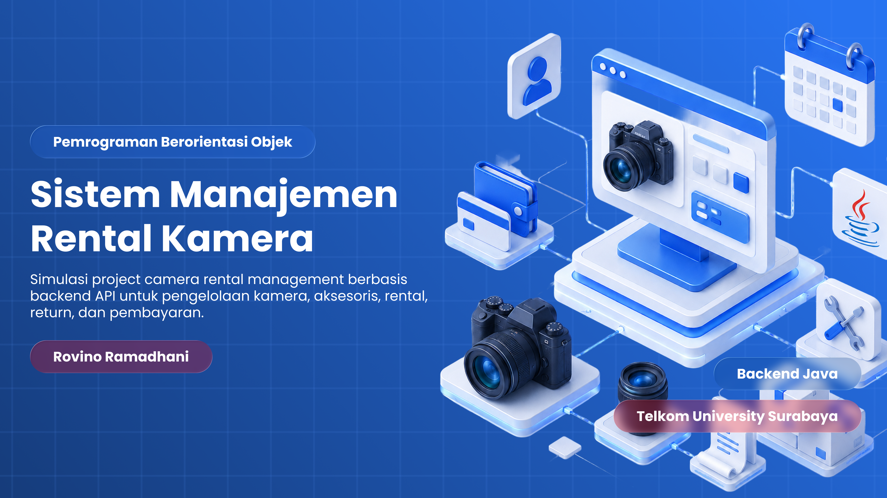

# Camera Rental Backend API



Repository ini berisi implementasi backend API untuk sistem Camera Rental Management menggunakan Spring Boot.

Program ini dibuat untuk tugas besar PBO (Pemrograman Berbasis Objek) di Telkom University Surabaya. Project ini
berfungsi sebagai API backend yang nantinya dapat digunakan oleh aplikasi frontend Camera Rental Management.

## Informasi Mahasiswa

Nama : Rovino Ramadhani  
NIM : 103072400031  
Program Studi : S1 Informatika  
Universitas : Telkom University Surabaya

## Fitur yang Tersedia

1. Autentikasi admin menggunakan login, logout, dan token session.
2. Pengelolaan admin dengan role super_admin dan admin.
3. Pengelolaan customer sebagai data penyewa.
4. Pengelolaan category dan category detail.
5. Pengelolaan item kamera dan aksesoris.
6. Pengelolaan payment method seperti QR, transfer bank, cash, dan e-wallet.
7. Pengelolaan transaksi rental.
8. Pengelolaan pembayaran rental.
9. Pengelolaan return atau pengembalian barang.
10. Pengelolaan denda.
11. Pengelolaan maintenance item.
12. Generate laporan dalam bentuk CSV.
13. Validasi role, stok item, status rental, dan status pembayaran.
14. Response API menggunakan format JSON yang konsisten.

## Struktur Project

pom.xml  
src/main/java/com/rvinproject/camerarentalbe  
src/main/resources/db.migration  
schema_database.plantuml

## Cara Menjalankan

Pastikan Java, Maven, dan MySQL sudah terpasang.

Sesuaikan konfigurasi database pada file application.properties atau application.yml.

Jalankan project dengan perintah:

```
mvn spring-boot:run
```

Project akan berjalan sebagai backend API dan dapat diuji menggunakan Postman, Insomnia, atau API client lainnya.

## Berbasis API untuk Frontend

Project ini dibuat sebagai backend API yang dapat dihubungkan dengan aplikasi frontend. Frontend dapat menggunakan
endpoint API dari backend ini untuk melakukan login admin, menampilkan data customer, mengelola item, membuat rental,
mencatat pembayaran, mencatat pengembalian, mengelola denda, dan mengambil laporan.

Repository frontend dapat dibuat secara terpisah, misalnya:

[https://github.com/rovinor4/CameraRentalFe](https://github.com/rovinor4/CameraRentalFe)

## Alur Sistem

1. Admin melakukan login untuk mendapatkan token session.
2. Frontend menyimpan token dan mengirimkannya pada request API berikutnya.
3. Admin mengelola data master seperti customer, category, item, dan payment method.
4. Admin membuat transaksi rental berdasarkan customer dan item yang disewa.
5. Sistem menghitung total rental dan memvalidasi stok item.
6. Admin mencatat pembayaran rental.
7. Admin mencatat pengembalian barang.
8. Jika ada keterlambatan, kerusakan, atau kehilangan, admin mencatat denda.
9. Admin dapat menghasilkan laporan dalam format CSV.

## Output Program

1. Response API dalam format JSON.
2. Data admin.
3. Data customer.
4. Data category dan category detail.
5. Data item.
6. Data payment method.
7. Data rental.
8. Data rental payment.
9. Data return.
10. Data denda.
11. Data maintenance.
12. Laporan CSV.

## Konsep PBO yang Digunakan

1. Class untuk membuat entity, controller, service, repository, request, dan response.
2. Object untuk merepresentasikan admin, customer, item, rental, return, dan denda.
3. Encapsulation untuk memisahkan data dan proses sesuai tanggung jawab class.
4. Abstraction untuk memisahkan controller, service, dan repository.
5. Enum untuk membatasi nilai role, status item, status rental, status pembayaran, dan jenis denda.

## Library yang Digunakan

1. Spring Boot untuk membuat backend API.
2. Spring Web MVC untuk membuat REST API.
3. Spring Data JPA untuk mengelola database.
4. Spring Security untuk autentikasi dan authorization.
5. Spring Validation untuk validasi request.
6. Flyway untuk migration database.
7. MySQL Connector untuk koneksi database MySQL.
8. Lombok untuk menyederhanakan penulisan kode.
9. Maven untuk dependency management.

## Referensi

1. Spring Boot
   Documentation - [https://docs.spring.io/spring-boot/index.html](https://docs.spring.io/spring-boot/index.html)
2. Spring Web MVC
   Documentation - [https://docs.spring.io/spring-framework/reference/web/webmvc.html](https://docs.spring.io/spring-framework/reference/web/webmvc.html)
3. Spring Data JPA
   Documentation - [https://docs.spring.io/spring-data/jpa/reference/](https://docs.spring.io/spring-data/jpa/reference/)
4. Spring Security
   Documentation - [https://docs.spring.io/spring-security/reference/](https://docs.spring.io/spring-security/reference/)
5. Flyway Documentation - [https://documentation.red-gate.com/fd](https://documentation.red-gate.com/fd)
6. MySQL Documentation - [https://dev.mysql.com/doc/](https://dev.mysql.com/doc/)
7. Lombok Documentation - [https://projectlombok.org/features/](https://projectlombok.org/features/)

## Catatan

Repository ini dibuat untuk kebutuhan tugas besar PBO. Sistem ini hanya menyediakan backend API, bukan tampilan
frontend. Customer hanya digunakan sebagai data penyewa, sedangkan login hanya digunakan oleh admin.
